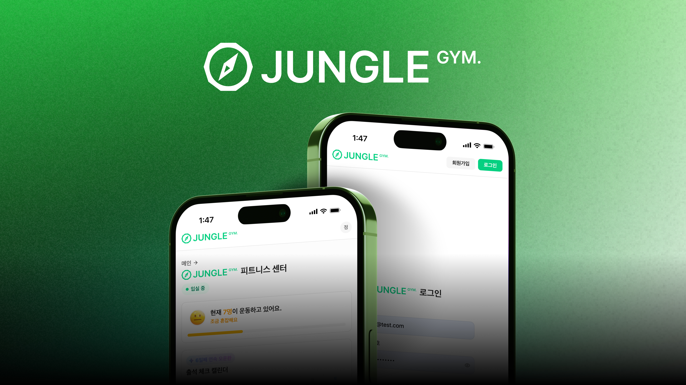
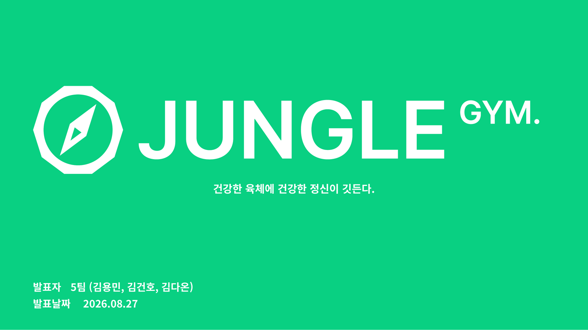
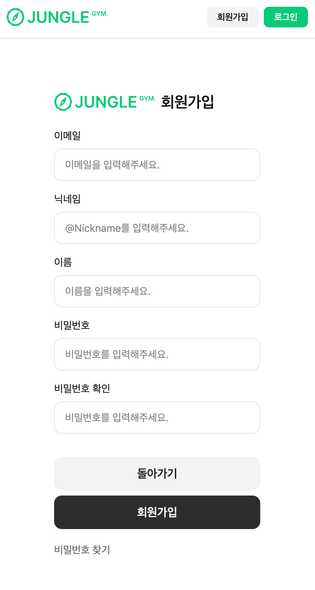
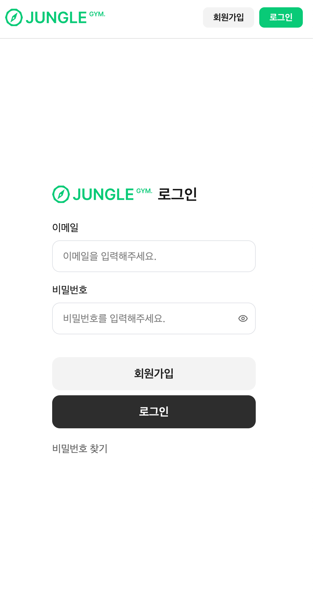
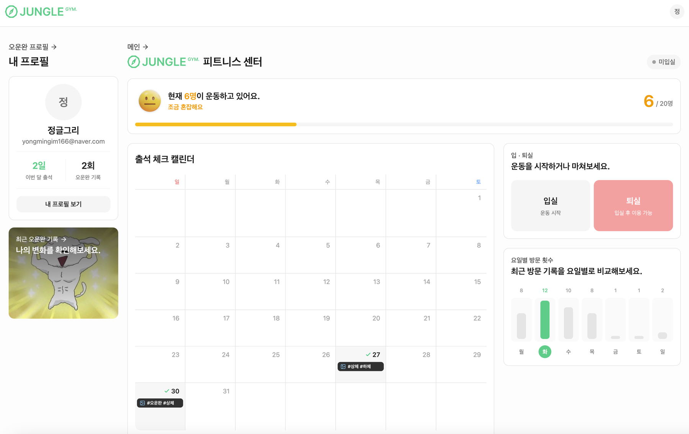
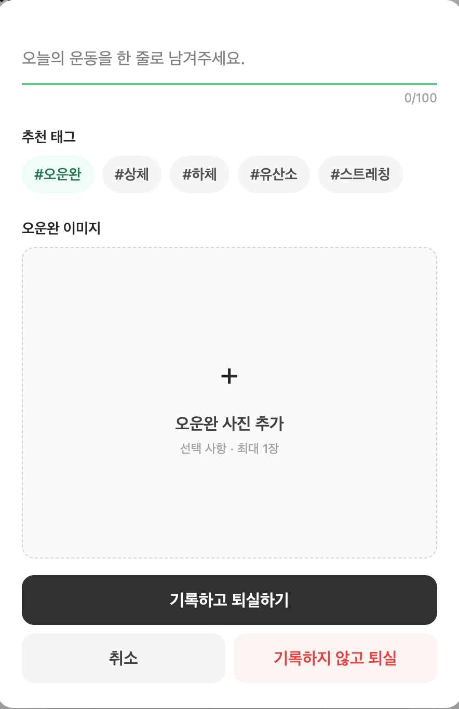
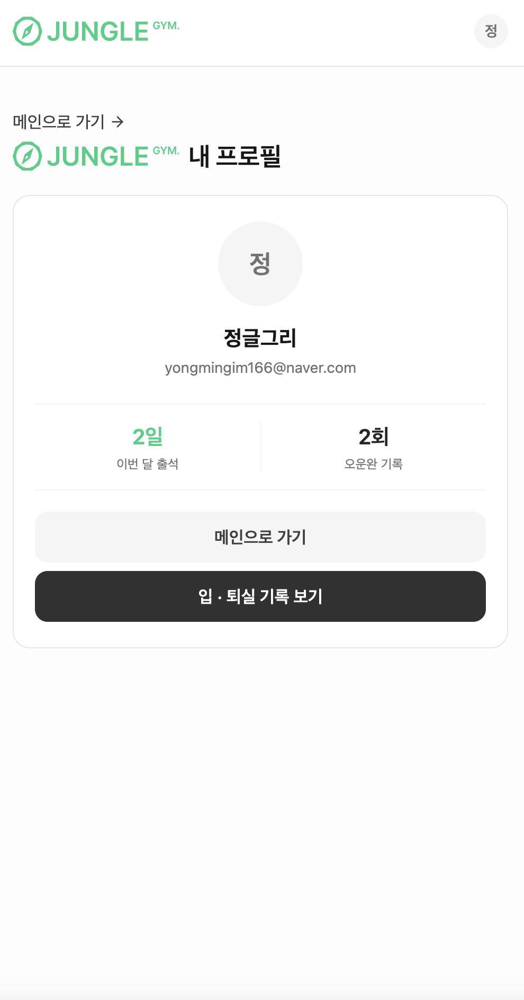
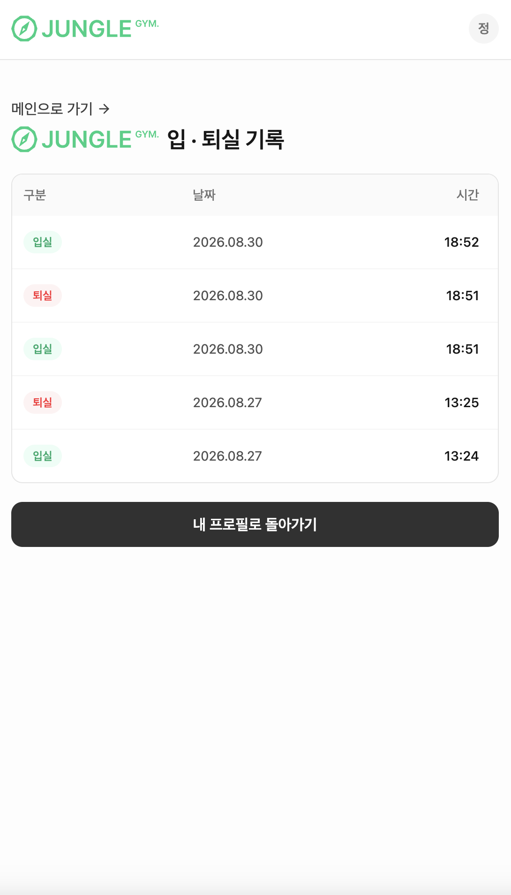

# JungleGym (정글짐)
### 정글 1주차 미니프로젝트 (크래프톤 정글 내 헬스장 혼잡도 현황 및 오운완 자기관리 서비스)

### 팀원 소개

- 크래프톤 정글 SW-AI랩 13기 17번 **김다온** — UI/UX 디자인, 프론트엔드
- 크래프톤 정글 SW-AI랩 13기 24번 **김건호** — JWT 인증 로직, 백엔드
- 크래프톤 정글 SW-AI랩 13기 32번 **김용민** — 백엔드

## 📄 발표 자료

  <a href="./docs/junglegym-presentation.pdf">
     
    <b>발표 자료 보기 (PDF · 10장)</b>
  </a>

## 📸 미리보기

<table>
  <tr>
    <td width="50%" align="center">
       
      <b>① 회원가입</b> 
      이메일 · 닉네임 · 비밀번호로 가입
    </td>
    <td width="50%" align="center">
       
      <b>② 로그인</b> 
      가입한 계정으로 로그인
    </td>
  </tr>
  <tr>
    <td colspan="2" align="center">
       
      <b>③ 메인 — 피트니스 센터</b> 
      실시간 혼잡도 · 출석 체크 캘린더 · 요일별 방문 횟수 · 입/퇴실
    </td>
  </tr>
  <tr>
    <td width="50%" align="center">
       
      <b>④ 퇴실 &amp; 오운완 기록</b> 
      한 줄 기록 · 태그 · 인증 사진 첨부 후 퇴실
    </td>
    <td width="50%" align="center">
       
      <b>⑤ 내 프로필</b> 
      이번 달 출석일 · 누적 오운완 기록 확인
    </td>
  </tr>
  <tr>
    <td colspan="2" align="center">
       
      <b>⑥ 입·퇴실 기록</b> 
      날짜별 입실 / 퇴실 시각 조회
    </td>
  </tr>
</table>
